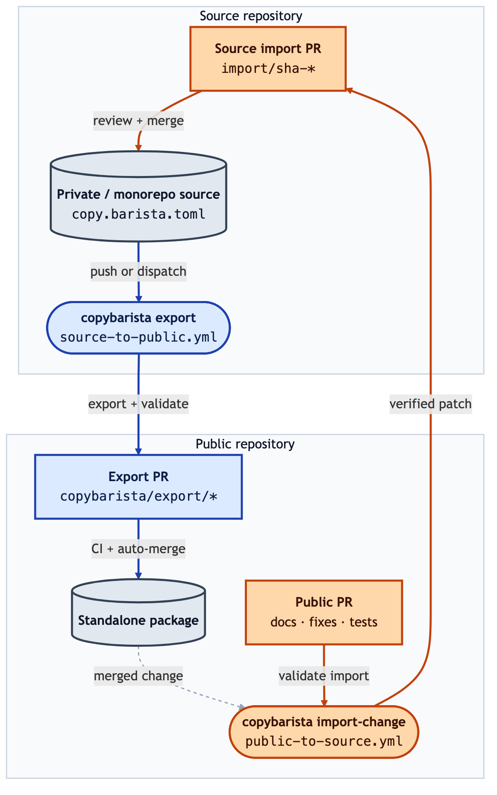

<h1 align="center">Copybarista</h1>

<p align="center">
  Publish and sync clean standalone repositories from private or monorepo source trees.
</p>

<p align="center">
  
</p>

<p align="center">
  
  <a href="https://pypi.org/project/copybarista/"></a>
  <a href=".github/workflows/ci.yml"></a>
  <a href="LICENSE"></a>
</p>

<p align="center">
  <a href="docs/config-reference.md">Config reference</a>
  ·
  <a href="docs/tutorial.md">Tutorial</a>
  ·
  <a href="examples/README.md">Examples</a>
  ·
  <a href="docs/github-setup.md">GitHub setup</a>
</p>

## Why should I use this?

Copybarista is for teams running Python that publish OSS packages from private or monorepo
source trees:

- Primary source code is embedded inside another repository, often private.
- The standalone OSS repository should be automatically assembled, not hand-maintained.
- Public fixes should sync and flow back through normal pull requests.
- The team wants Python-native tooling that fits Python packaging and CI.

Copybarista turns a selected source subtree into a clean repository tree. It
copies only the files you choose, rewrites text deterministically, and writes
either a local folder or one squash commit on a Git branch.

Use it when the private or monorepo checkout should stay canonical, but a
package, tool, or library needs to live in a separate repository. Syncs are
reviewed as pull requests, and public changes can be imported back only when
Copybarista can map and verify them safely.

## What Copybarista Does

- Publish a package from a larger repository without moving files by hand or
  maintaining custom sync scripts.
- Keep the source checkout canonical while exporting an exact public tree.
- Rewrite imports, docs, or generated blocks as part of the export.
- Use the example GitHub workflows to review syncs as pull requests instead of
  pushing to `main`.
- Bring public fixes back into source only when the reverse mapping verifies.
- Reject unsupported config instead of guessing and producing a surprising
  export.

<p align="center">
  
</p>

Generated export PRs are workflow-owned and can auto-merge after required
checks. Public changes flow back through separate source PRs so maintainers can
review what enters the private or monorepo source of truth.

## Why not just use an Alternative Tool?

There are mainly two other approaches that we found most closely can solve the problem:

- Git subtree and `git-filter-repo` with custom tooling for code transformations
- Copybara, which is a very powerful, mature tool for broad migration, using a Java-based runtime

We recommend starting with the two above approaches first if it matches your requirements (see table below).

Copybarista is intentionally narrowly scoped: it's a Python program which
publishes clean OSS packages from private or monorepo sources while rewriting
the exported tree and syncing through GitHub pull requests. Built and
maintained by [rekursiv.ai](https://rekursiv.ai), it manages syncs between
repositories while fitting a Python and GitHub toolchain.

Short version:

| Need | Copybarista | Copybara | Git subtree / `git-filter-repo` |
| --- | --- | --- | --- |
| Python package workflow | :white_check_mark: Built for Python repos, TOML config, Python CI | :warning: Powerful, but Java/Starlark-based | :warning: Git-first; project behavior becomes scripts |
| Rewrite imports/docs/private blocks | :white_check_mark: Built in | :white_check_mark: Broad transform model | :x: Requires custom scripts |
| GitHub PR sync in both directions | :white_check_mark: Example export/import workflows | :warning: Requires workflow glue | :x: No built-in PR workflow |
| Preserve full history | :x: Squash-style export focus | :white_check_mark: Yes | :white_check_mark: Yes |
| General migration engine | :x: Intentionally scoped | :white_check_mark: Yes | :x: No |

- Use Copybarista when the hard part is not splitting history, but producing a
  clean OSS package repository with deterministic rewrites, private-name
  checks, and GitHub PR syncs.
- Use Copybara when you need a more general purpose, broader migration
  engine.
- Use Git subtree or `git-filter-repo` when history preservation is the
  main goal and the subtree is already self-contained.

The [detailed comparison](#detailed-comparison) below lists the specific
workflow capabilities.

## Install

```bash
uv tool install copybarista
copybarista --help
```

Other options:

```bash
uv add copybarista
pipx install copybarista
pip install copybarista
```

Copybarista requires Python 3.12. Git exports also require the system
`git` executable.

## Quick Start

Create `copy.barista.toml` at the root of the source checkout:

```toml
[workflow]
name = "widget"
mode = "squash"
source_root = "packages/widget"

[destination.folder]
path = "/tmp/widget-oss"

[files]
include = ["**"]
exclude = [
  ".pytest_cache/**",
  "**/.pytest_cache/**",
  ".ruff_cache/**",
  "**/.ruff_cache/**",
  ".venv/**",
  "**/__pycache__/**",
  "*.pyc",
  "**/*.pyc",
  "dist/**",
]

[[transform]]
type = "replace"
path = "tests/test_widget.py"
before = "from monorepo.packages.widget import"
after = "from widget import"
```

Validate the config and export the standalone tree:

```bash
copybarista validate copy.barista.toml
copybarista export copy.barista.toml /path/to/source \
  --folder-dir /tmp/widget-oss
```

If `/tmp/widget-oss` already exists, pass `--force` to replace it after
Copybarista's destination safety checks:

```bash
copybarista export copy.barista.toml /path/to/source \
  --folder-dir /tmp/widget-oss \
  --force \
  --json
```

The `source_ref` argument is the checkout root. `workflow.source_root` is
resolved relative to that root, and exported files land at the destination
root.

## Common Workflows

### Export To A Folder

Use folder export for local inspection, release checks, and tests:

```bash
copybarista export copy.barista.toml /path/to/source \
  --folder-dir /tmp/widget-oss \
  --force
```

Folder export replaces the destination contents after safety checks. Existing
destinations require `--force`; the flag never disables those safety checks.

### Export To Git

Use Git export when the standalone repository should receive one clean sync
commit. GitHub PR sync usually uses folder export into a checked-out public
repository and then opens a PR branch; `publish-git` is for local mirrors,
unprotected destinations, or deliberate non-PR workflows.

Add a Git destination:

```toml
[destination.git]
url = "file:///tmp/widget-oss.git"
branch = "main"
committer_name = "Widget Export"
committer_email = "opensource@example.com"
```

Then run:

```bash
copybarista publish-git copy.barista.toml /path/to/source
```

Git export updates a cached bare mirror, copies the transformed tree into a
temporary checkout, creates one commit when the destination changes, and pushes
it to the configured branch. Generated commits include `Copybarista-Source-Rev` when
the source checkout has a Git `HEAD`. Local `file://` remotes must already be
Git repositories or existing empty directories that Copybarista can initialize
as bare repositories.

### Import Public Changes

Use `import-change` when a public repository change needs to move back into the
source checkout:

```bash
copybarista import-change copy.barista.toml \
  --public-base /tmp/public-base \
  --public-head /tmp/public-head \
  --source-base /tmp/source-base \
  --destination /tmp/source-worktree
```

Verification is enabled by default. The source base must reproduce the public
base, and the imported destination must re-export to the public head. Failed
imports roll back touched destination paths.

### Use A Supported `copy.bara.sky`

Copybarista can directly run the supported subset of `copy.bara.sky`
workflows:

```bash
copybarista export copy.bara.sky /path/to/source \
  --folder-dir /tmp/out \
  --force
```

Or translate the workflow to TOML first:

```bash
copybarista translate copy.bara.sky --workflow export \
  --output copy.barista.toml
copybarista validate copy.barista.toml
```

## What It Supports

- Local source checkouts, passed as a CLI path.
- Local folder exports with explicit `--force` for existing destinations.
- Single-commit Git exports.
- Include/exclude globs using `*`, `**`, `?`, braces, character classes, and
  escaped literals.
- Source-root selection that moves the selected subtree to destination root.
- Literal whole-file text replacements.
- Marker-delimited block stripping for exact file paths.
- Native TOML configs for Copybarista workflows.
- Direct export from supported `copy.bara.sky` workflows via internal
  translation.
- Manual translation from supported `copy.bara.sky` workflows to TOML.
- Local change-request import for public repository edits.
- JSON export manifests with file hashes and transform reports.
- Strict config validation so unsupported fields fail loudly.

Copybarista supports a documented `copy.bara.sky` subset for common repository
export workflows. It is not a full migration-engine clone. Unsupported
constructs fail with explicit errors instead of being ignored.

## CLI

```text
copybarista validate CONFIG [--workflow NAME]
copybarista translate COPY_BARA_SKY [--workflow NAME] [--output CONFIG]
copybarista export CONFIG SOURCE_REF [--workflow NAME] \
  [--folder-dir DIR] [--force] [--json]
copybarista publish-git CONFIG SOURCE_REF [--workflow NAME] [--json]
copybarista import-change CONFIG --public-base DIR --public-head DIR \
  --source-base DIR --destination DIR [--workflow NAME] [--no-verify] [--json]
```

`CONFIG` can be a Copybarista TOML file or a supported `copy.bara.sky` file.
`export` uses `--folder-dir` when supplied, otherwise
`destination.folder.path` from the config. Folder export replaces destination
contents after safety checks. Existing destinations require `--force`; the flag
never disables safety checks.

`import-change` imports a public change-request tree into a source-of-truth
checkout using the supported reversible transform subset. It requires
local public base, public head, source base, and destination checkouts so tests
and workflows can run without network access. Verification is enabled by
default: the source base must reproduce the public base, and the imported
destination must re-export to the public head. Failed imports roll back touched
destination paths.

`--workflow` selects a named workflow from `copy.bara.sky`; `publish-git`
defaults to `export_git`, and other commands default to `export`.

## Bidirectional Sync Model

Copybarista sync is PR-based in both directions:

- Source to public: the source workflow exports the configured source root into
  a temporary tree, validates the exported checkout, and opens a PR in
  the public repository from a generated `copybarista/export/*` branch. Reruns
  can update the same branch so there is one active export PR per project
  branch. The generated branch is replaced with `git push --force-with-lease`.
- Public to source: the public workflow checks out a public base and public
  head, runs `copybarista import-change`, validates the target checkout, and
  opens a source PR from `copybarista/import/sha-<public-sha>`. Regenerating
  that import branch also uses `git push --force-with-lease`.

The public repository CI checks release-tree policy, lint, formatting, types,
unit tests, package build, and installed-wheel import. The reverse-sync
workflow also runs on trusted public PRs as an import validation check, except
for generated `copybarista/export/*` PRs whose source of truth is the export
workflow. Public `main` pushes from merged generated export PRs are skipped for
the same reason when the push commit is authored by `copybarista` or the
commit message identifies a generated export branch. Reverse sync only opens a
source PR for direct public changes or manual-dispatch runs.

No workflow should push directly to a protected default branch. Generated sync
branches are workflow-owned artifacts; do not push manual commits to them.
`--force-with-lease` lets reruns replace generated commits while refusing to
overwrite unexpected remote updates. Conflicts are handled in two layers:
GitHub blocks textual PR conflicts, and
`copybarista import-change` blocks semantic conflicts such as unmapped files,
excluded paths, metadata writes, non-reversible transforms, public-base
mismatches, and re-export mismatches. VCS and `.copybarista` metadata are
ignored while diffing and refused as write targets. If both repositories
changed the same public file, import the public PR to source first or
re-export source and resolve the PR diff explicitly.

Source-to-public auto-merge is safe only as PR auto-merge after required checks
pass, not as direct default-branch pushes. Keep public-to-source imports manual
unless your project has a separate review policy for accepting public changes.
For protected branches, required checks, bot-authored PRs, and token
permissions, see [GitHub setup](docs/github-setup.md).

## Compatibility

Copybarista's native config format is TOML. The preferred filename is
`copy.barista.toml`. It can also accept a supported `copy.bara.sky` workflow:
the CLI translates the supported subset internally, validates the generated
Copybarista config, and then runs the same export engine.

| Feature | Native TOML | `copy.bara.sky` import | Limits |
| --- | --- | --- | --- |
| Workflow mode | `mode = "squash"` | `mode = "SQUASH"` | Change/history modes fail |
| Source checkout | CLI `SOURCE_REF` | `folder.origin()` | Remote origins fail |
| Root move | `source_root` | `core.move(ROOT, "")` | Non-root destinations fail |
| File globs | `include` / `exclude` | `glob(..., exclude=...)` | Unsupported glob constructs fail |
| Folder export | `[destination.folder]` | `folder.destination()` | Needs `--force` for existing folders |
| Git export | `[destination.git]` | `git.destination(...)` | Single-commit export |
| Literal replace | `type = "replace"` | `core.replace(...)` | Regex/options fail |
| Strip block | `type = "strip_block"` | Empty multiline replace | Marker form only |
| Arbitrary logic | Not supported | Rejected | No Starlark execution |
| Copybara review flows | Not supported | Rejected | Use local `import-change` |

The import path is static translation, not full Starlark interpretation. When
Copybarista sees an unsupported origin, destination, mode, transform, option,
or expression, it reports a config error instead of silently changing behavior.

Supported `copy.bara.sky` forms include `authoring.pass_thru(default=...)`,
positional `git.destination("url", push="main")`, omitted `origin_files` and
`destination_files`, `core.transform([...])`, explicit replace reversal, and
`core.reverse([...])` for literal replacements.

## Detailed Comparison

| Need | Copybarista | Copybara | Git subtree / `git-filter-repo` |
| --- | --- | --- | --- |
| Python packaging ecosystem | :white_check_mark: Yes: Python package, installable with `uv`, `pipx`, or `pip` | :x: No: Java-based toolchain | :warning: Partial: Git-first workflow with optional Python `git-filter-repo` install |
| Python project ergonomics | :white_check_mark: Yes: TOML config, pytest-friendly helper scripts, Python CI fit | :warning: Partial: powerful, but configured through Starlark and a separate runtime | :warning: Partial: easy to shell out, but project-specific behavior becomes custom scripts |
| GitHub ecosystem fit | :white_check_mark: Yes: example workflows open export/import PRs for review | :warning: Possible, but requires workflow glue | :x: No built-in PR workflow |
| Select a subtree and publish it as a standalone repository | :white_check_mark: Yes: selected files land at repository root | :white_check_mark: Yes: broader repository migration model | :white_check_mark: Yes: this is the core Git subtree / filtering use case |
| Assemble a public tree from selected files and directories | :white_check_mark: Yes: include/exclude globs select the exported tree | :white_check_mark: Yes: broader file-selection model | :warning: Partial: possible with path filters, but awkward for multiple locations |
| Keep full source history | :x: No: squash-style export is the focus | :white_check_mark: Yes | :white_check_mark: Yes: this is where Git subtree and `git-filter-repo` fit best |
| Rewrite absolute Python imports for the public package | :white_check_mark: Yes: supported literal replacements | :white_check_mark: Yes: broader transform model | :x: No: Git leaves file contents unchanged |
| Strip private README sections, generated blocks, or internal names | :white_check_mark: Yes: block stripping and release-tree checks | :white_check_mark: Yes: broader transform model | :x: No: requires custom scripts and leak checks |
| Leave private files out of the public repo | :white_check_mark: Yes: explicit include/exclude globs plus export validation | :white_check_mark: Yes: broader file-selection model | :warning: Partial: path filtering helps, but deeper cleanup is custom |
| Import public fixes back into the source checkout | :white_check_mark: Yes: reverse import verifies by re-exporting | :white_check_mark: Yes: supports bidirectional repository movement | :warning: Partial: subtree can move history, but not verify semantic rewrites |
| Fail loudly on unsupported rewrites | :white_check_mark: Yes: unsupported config is rejected | :white_check_mark: Yes: full config parser and migration engine | :x: No transform model to validate |
| Full migration engine | :x: No: intentionally scoped to package sync | :white_check_mark: Yes | :x: No |

## Intentional Scope

Copybarista is designed for GitHub-oriented package sync. The supported model is:

- A private or internal checkout is the source of truth.
- A selected subtree is exported as an exact standalone repository tree.
- GitHub Actions can open or update PRs in either direction.
- Public PR imports are accepted only when paths and transforms can be mapped
  back safely and verified by re-exporting.

The following are intentional non-goals until a real workflow needs them:

- Running arbitrary Starlark.
- Supporting a full origin and destination plugin model.
- Preserving per-commit history or iterative migration modes.
- Destination-file scoped partial cleanup instead of exact-tree replacement.
- Regex-template transforms beyond the literal replacement subset.
- A general transform plugin API.
- External implementation details such as cache directory layout.

## Documentation

- [Tutorial](docs/tutorial.md): build and run a minimal folder export.
- [Examples](examples/README.md): set up a full source-to-public and
  public-to-source GitHub PR workflow.
- [Config reference](docs/config-reference.md): TOML fields, transforms, CLI
  behavior, and manifest shape.
- [Architecture](docs/architecture.md): implementation boundaries and internal
  APIs.
- [GitHub setup](docs/github-setup.md): recommended repository rules,
  branch protection, and release publishing defaults.

## Development

```bash
python scripts/check_release_tree.py . --allow-root-git
uv sync --all-groups
uv run --all-groups ruff check .
uv run --all-groups ruff format --check .
uv run --all-groups basedpyright copybarista tests scripts
uv run --all-groups pytest
uv build --out-dir /tmp/copybarista-dist-check
```

Clean generated local artifacts:

```bash
uv run python scripts/clean.py
uv run python scripts/clean.py --venv
```

Run the local benchmark helper when changing file selection, glob matching, or
copy logic:

```bash
uv run python scripts/bench.py copy.barista.toml /path/to/source \
  --runs 5 \
  --json
```

Unit tests live next to the modules they cover as `*_test.py`. The top-level
`tests/` directory is reserved for integration tests plus fixtures.

## Contributing

Copybarista is intentionally conservative. When adding behavior, document the
config surface, add focused tests, keep exports deterministic, and reject
unsupported config instead of guessing.

## Acknowledgements

Copybarista's repository-sync model is inspired by
[Copybara](https://github.com/google/copybara), Google's open-source tool for
transforming and moving code between repositories. Copybara is licensed under
the Apache License 2.0.

Copybarista is an independent Python implementation focused on
package-oriented GitHub PR workflows. It does not vendor or copy Copybara
source code, documentation, logos, or test data, and it is not affiliated with
or endorsed by Google or the Copybara project.
